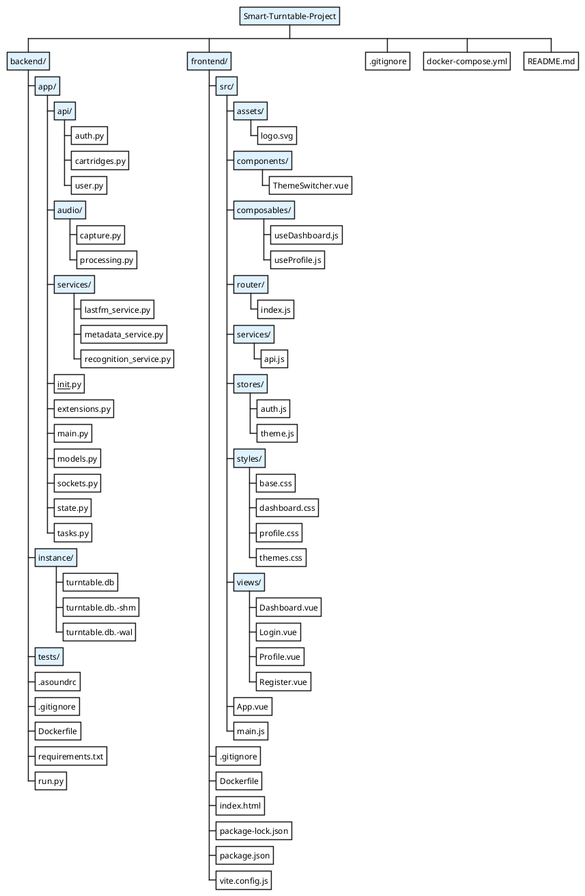
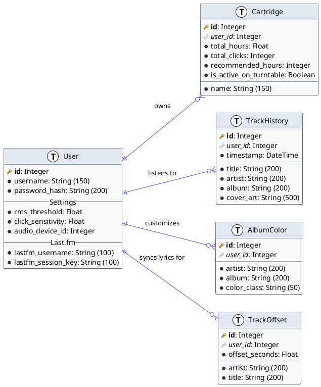
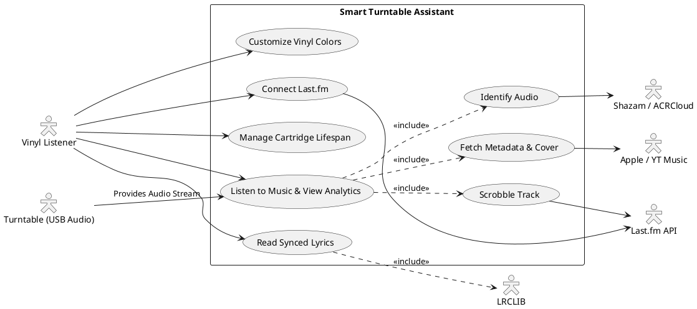
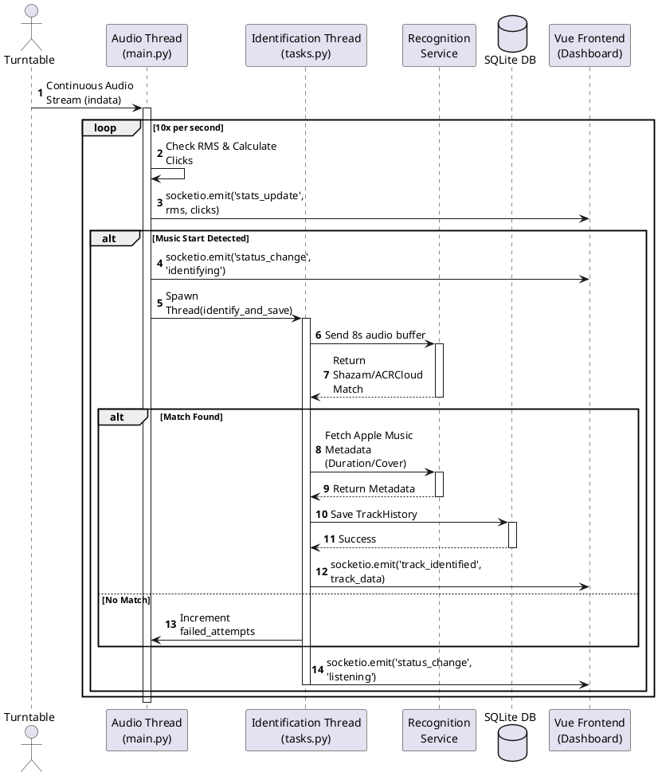
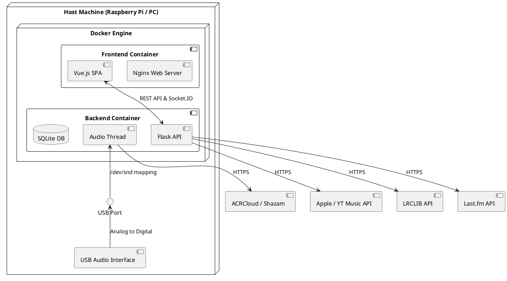
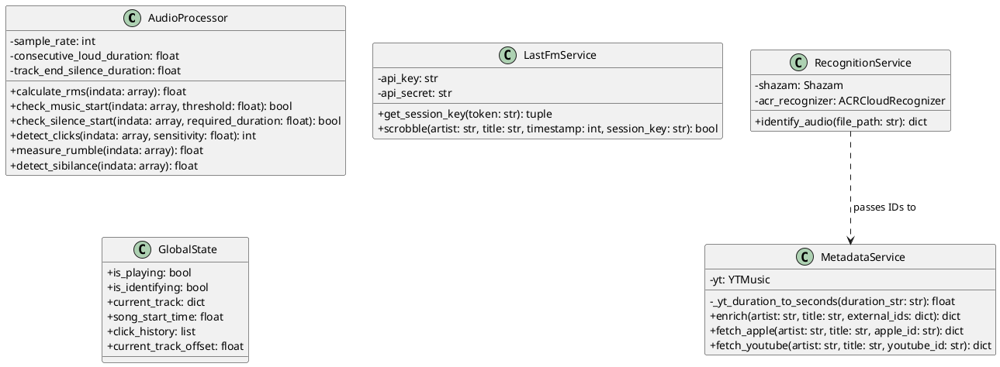

# Folder Structure
---

---
# Database Structure (Entity Relationship Diagram)
---

---
# Use Case Diagram
---

---
# Sequence Diagram
---

---
# Deployment / Architecture Diagram
---

---
# Software Class Diagram 
---

